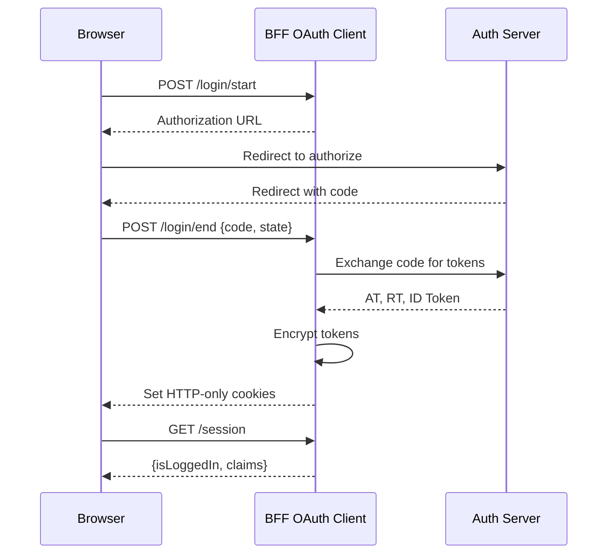
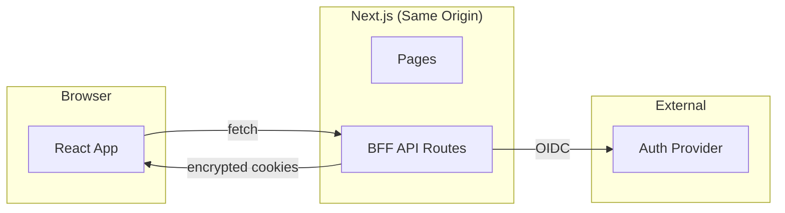

# BFF OAuth

A Backend for Frontend (BFF) OAuth implementation following Zero Trust principles.

## The Pattern

Browser-based apps are public clients - they can't securely store secrets. Traditional approaches store tokens in localStorage or regular cookies, both accessible via JavaScript and vulnerable to XSS attacks. The BFF pattern solves this by keeping tokens server-side in encrypted HTTP-only cookies, making them invisible to JavaScript entirely.



## Security Features

- **PKCE** - Protects authorization code flow
- **Encrypted cookies** - Tokens encrypted with AES-256-GCM
- **HTTP-only + Secure + SameSite=Strict** - XSS and CSRF protection
- **Confidential client** - Server holds client_secret
- **State parameter** - CSRF protection for OAuth flow

## Architecture



## Run

```bash
yarn dev
```

- App: http://localhost:3000
- Mock OIDC discovery: http://localhost:9000/.well-known/openid-configuration

## Test

```bash
yarn test          # unit tests
yarn test:e2e      # playwright (requires yarn dev running)
```